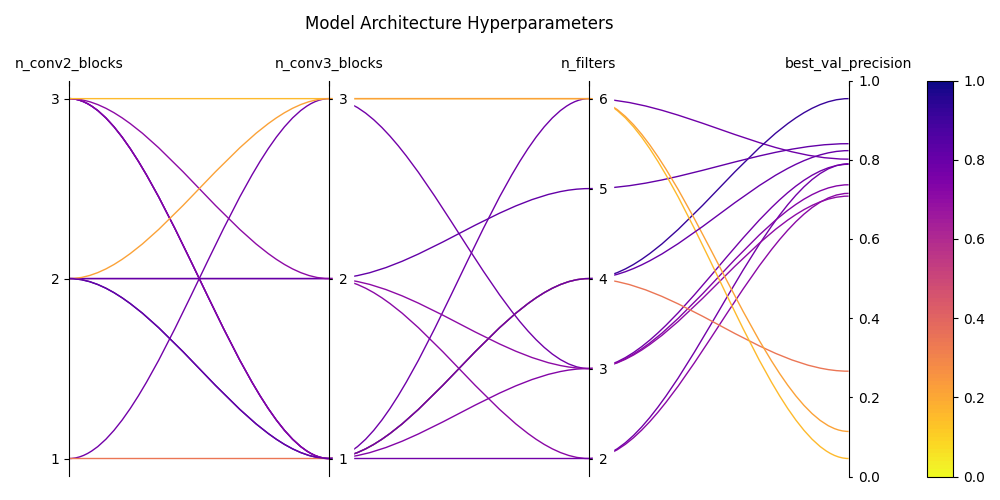

# plotter
For ~~nefarious~~ plot-generating purposes.

## Sample
```python
import wandb
from tools import plots, get_config

api = wandb.Api()
config = get_config("configs/edge_nn.yaml")
df = config.get_sweeps_df(api, config.sweep_id)

plots.hyperparams(df, show=True)
```
